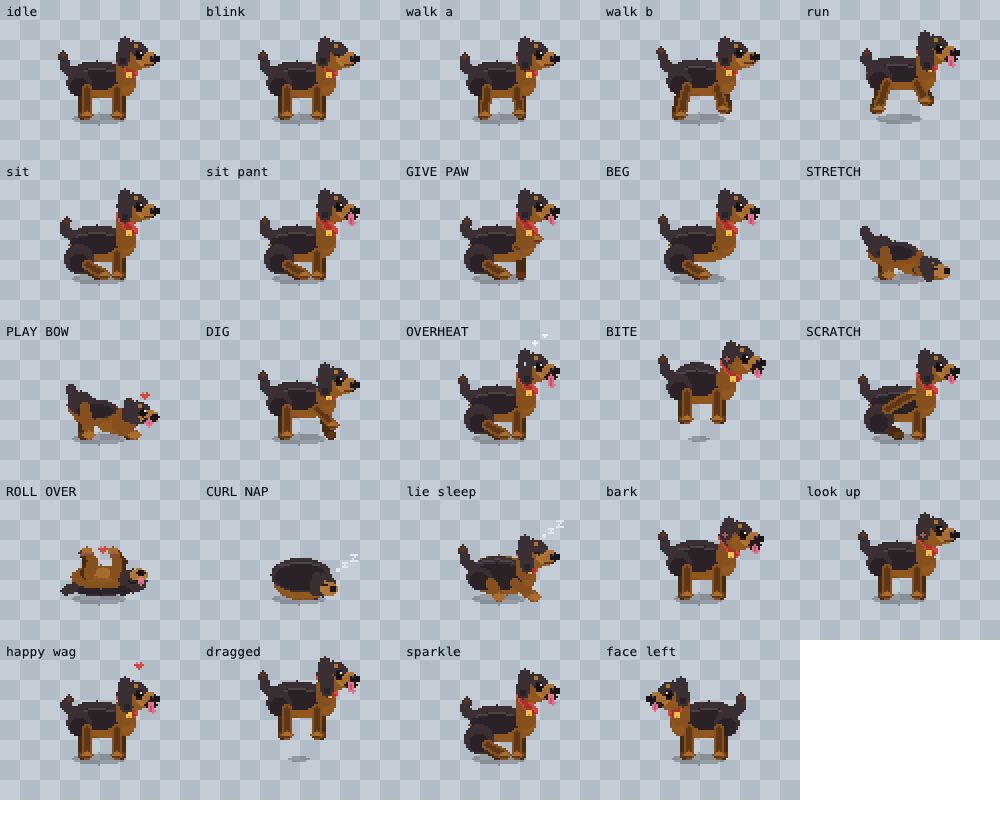

# 🐾 Rio — your pixel desktop dog

Rio is a tiny black‑and‑tan pixel dog who lives on top of your screen. He trots
along the floor above your dock, watches your cursor, chases fast mouse moves,
**leaps up and snaps at the cursor when it gets too close**, naps in a cosy curl,
rolls over for belly rubs, begs for treats, and — best of all — **reacts to
Claude Code**: he thinks along while your agent works and does happy zoomies
when a task finishes.

A dog‑flavoured homage to [comnyang](https://www.comnyang.com/) (the desktop
*cat*), built from scratch in Electron with a fully procedural pixel‑art rig —
every pose is drawn in code, modelled after a real dog named **Rio**.

> A weekend hobby project. 🐶



---

## Run it

```bash
npm install      # one time
npm start        # let Rio out
```

Rio appears near the bottom of your screen and starts pottering about. He lives
in the **menu bar** (look for the 🐾 paw), not the dock. He uses no special
permissions. Lost him? Menu‑bar paw → **Come here**, or press **⌘⇧D** to
summon/hide.

Prefer a real app? See [Building a `.app` / `.dmg`](#building-an-app).

---

## Things to do with Rio

| You do… | Rio does… |
|---|---|
| Move the mouse | His eyes follow you |
| Whip the cursor past him | He gives **chase** |
| Move the cursor right up to him | He **jumps up and bites** at it (`nom!`) |
| Sweep the cursor over his head | Happy **pet** — tail wag, panting, hearts |
| Click‑and‑drag him | Picks him up (legs dangle, mochi‑stretch); **drop** him and he bounces down with a squash |
| Double‑click him | **Bork!** |
| Type (optional) | He **taps along**, and **overheats** (panting + sweat) if you type fast |
| Scroll (optional) | He does a little **spin** |
| Leave him alone | He wanders, sits, **begs**, **stretches**, **play‑bows**, **digs**, scratches, sniffs, rolls over, or **curls up for a nap** (💤) |
| Every ~25 min | He nudges you with a **stretch break** (a literal downward dog) |

### Tricks (menu‑bar paw → Tricks)
Come here · Sit · Lie down/nap · Give paw · **Beg** · Roll over · **Play bow** ·
**Spin** · **Shake off** · **Dig** · **Stretch** · Speak · **Zoomies**

All of Rio's animations are generated procedurally from one parametric rig, so
they stay crisp at any size and never need sprite‑sheet assets.

## 🤖 Claude Code integration (the fun part)

Teach Rio to react to your coding agent. One command:

```bash
npm run install-hook
```

This adds a few **hooks** to your `~/.claude/settings.json` (idempotent; remove
with `npm run uninstall-hook`). After restarting Claude Code, Rio will:

- 🤔 put on a **thinking face** and show the current tool while Claude works,
- 🔔 perk up and **bark** when Claude needs your input,
- 🎉 do **zoomies + "all done!"** when a task finishes.

Under the hood Rio runs a tiny local server on `127.0.0.1:4279` accepting
`POST /agent-state` with `{ "state": "thinking" | "done" | "notification", ... }`,
so anything can drive him:

```bash
curl -s 127.0.0.1:4279/agent-state -d '{"state":"done"}'
```

---

## Settings

Menu‑bar paw → **Settings…**:

- **Your name** — Rio greets you by it.
- **Size** — Tiny / Small / Medium / Large (Small ≈ 1.5× is the default).
- **Follow the cursor** — chase fast mouse moves.
- **Jump & bite the cursor** — snap at it when it comes close.
- **React to typing** — tap along / overheat (needs macOS Accessibility; see below).
- **Sounds** — little barks & yips (**off by default**).
- **Claude Code** — enable/disable, set the port, copy the hook‑install command.

Stored locally in your user‑data folder. No telemetry, ever.

### Optional: typing & scroll reactions
With **React to typing** on (default), Rio taps along as you type, **overheats**
(panting + sweat) if you type fast, and **spins** when you scroll. This uses the
optional [`uiohook-napi`](https://www.npmjs.com/package/uiohook-napi) module
(installed automatically) and needs **macOS Accessibility** permission.

The first time, Rio asks for it and opens the right settings pane — enable the
app there (or your terminal, if you're running via `npm start`) under **System
Settings → Privacy & Security → Accessibility**. You can also grant it any time
from **Settings… → Grant…** or the menu‑bar **Grant typing access…** item. The
moment it's granted Rio starts reacting — no restart needed. Without it he just
ignores typing/scrolling, and everything else still works.

### Multi‑monitor
Rio roams across all your displays and steps onto each monitor's floor
correctly, whatever their arrangement (side‑by‑side, stacked, mixed sizes/scale).
Drag him to any screen and drop — he lands on that screen's floor.

---

## Building an app

```bash
npm run dist     # -> dist/Rio-<version>.dmg  (unsigned)
```

It's **unsigned** (no Apple Developer account), so on first launch macOS will
warn you. Right‑click the app → **Open** → **Open**, just once. Then it runs
like any menu‑bar app.

---

## How it's built

```
src/
  main/
    main.js            # the brain + muscle: window, behaviour state machine,
                       # global cursor, click-through, drag physics, multi-monitor
                       # placement, jump-bite, tray, settings, optional input hooks,
                       # and the Claude Code agent server
    preload.js / preload-settings.js   # secure contextBridge IPC
  renderer/
    rio.js             # the procedural pixel-art rig — Rio drawn entirely in code
    pet.js             # the body: turns behaviour + cursor into smooth animation
    index.html / style.css / settings.html
tools/
  gen-icons.js         # menu-bar + app icons (self-contained PNG encoder)
  rio-hook.js / install-claude-hook.js
```

**Design:** a transparent, frameless, always‑on‑top window (`screen-saver`
level, visible on all Spaces) that's click‑through everywhere except over Rio
himself — toggled by point‑testing the global cursor against his hitbox. The
main process owns Rio's screen position + a behaviour state machine; the
renderer eases each state into Rio's pose and adds life (breathing, blinks,
tail wag, gaze, squash‑and‑stretch). The rig draws into a 72×60 pixel buffer
blitted at integer scale with nearest‑neighbour sampling, so Rio stays crisp.

---

## Credits

- Rio, the very good dog this is modelled after. 🐕
- Inspired by **comnyang** by @Com_nyang.
- Built with [Electron](https://www.electronjs.org/) and [uiohook‑napi](https://github.com/SnosMe/uiohook-napi).

MIT licensed. Made with 🐾 as a hobby project.
